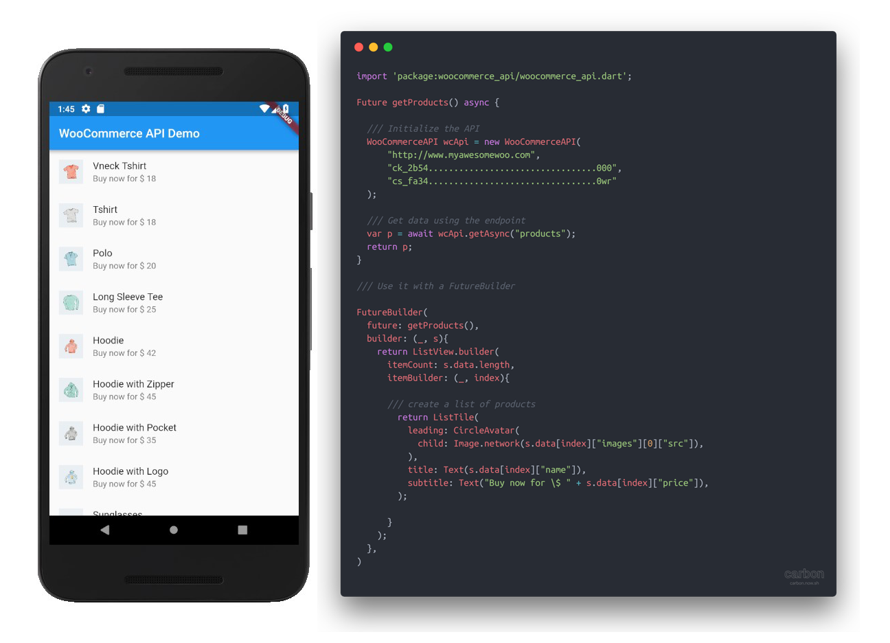

# WooCommerce SDK for Dart

A dart package to interact with the WooCommerce API. It uses OAuth1.0a behind the scenes to generate the signature and URL string. It then makes calls and return the data back to the calling function.



## Examples

### GET request (Fetch products)
```dart
Future getProducts() async {
  // Initialize the API
  WooCommerceAPI wooCommerceAPI = WooCommerceAPI(
      url: "https://www.yourwebsite.com",
      consumerKey: "ck_your_consumer_key",
      consumerSecret: "cs_your_consumer_secret");

  // Get data using the "products" endpoint
  var products = await wooCommerceAPI.getAsync("products");
  return products;
}
```
You can find a full example [here](example/fetch_products.dart)

### POST request (Create a customer)
```dart
Future createCustomer() async {
  try {
    var response = await wooCommerceAPI.postAsync(
      "customers",
      {
        "email": 's@c.com',
        "password": "123",
        "billing": {
          "first_name": "Samarth",
        }
      },
    );
    print(response); // JSON Object with response
  } catch (e) {
    print(e);
  }
}
```

### Report any issues if you face any or drop me an email at samarthagarwal@live.com

