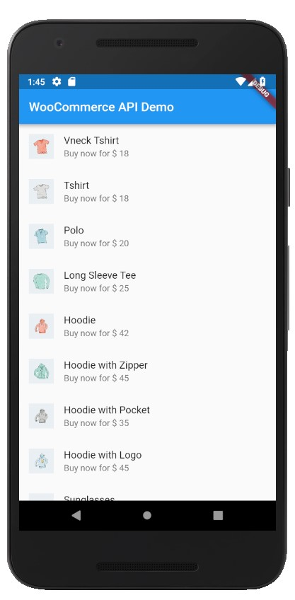

# woocommerce_api

A dart package to interact with the WooCommerce API. It uses OAuth1.0a behind the scenes to generate the signature and URL string. It then makes calls and return the data back to the calling function.

## Complete Usage Example
```
import 'dart:async';

import 'package:flutter/material.dart';
import 'package:woocommerce_api/woocommerce_api.dart';

void main() => runApp(new MyApp());

class MyApp extends StatelessWidget {
  @override
  Widget build(BuildContext context) {
    return new MaterialApp(
      title: 'Flutter Demo',
      theme: new ThemeData(
        primarySwatch: Colors.blue,
      ),
      home: new MyHomePage(title: 'WooCommerce API Demo'),
    );
  }
}

class MyHomePage extends StatefulWidget {
  MyHomePage({Key key, this.title}) : super(key: key);

  final String title;

  @override
  _MyHomePageState createState() => new _MyHomePageState();
}

class _MyHomePageState extends State<MyHomePage> {

  List<Widget> products = [];

  Future getProducts() async {

    /// Initialize the API
    WooCommerceAPI wc_api = new WooCommerceAPI(
        "http://samarth.todaylivedeal.com",
        "ck_2b548f9652a3468f67bbc5bdb04e48edf270a000",
        "cs_fa349f1ba49b519ba9493eb2b64c88781b286b52"
    );
    
    /// Get data using the endpoint
    var p = await wc_api.getAsync("products");
    return p;
  }

  @override
  void initState() {
    super.initState();
  }

  @override
  Widget build(BuildContext context) {
    return new Scaffold(
      appBar: new AppBar(
        title: new Text(widget.title),
      ),
      body: FutureBuilder(
        future: getProducts(),
        builder: (_, s){

          if(s.data == null){
            return Container(
              child: Center(
                child: Text("Loading..."),
              ),
            );
          }

          return ListView.builder(
            itemCount: s.data.length,
            itemBuilder: (_, index){
            
            /// create a list of products
              return ListTile(
                leading: CircleAvatar(
                  child: Image.network(s.data[index]["images"][0]["src"]),
                ),
                title: Text(s.data[index]["name"]),
                subtitle: Text("Buy now for \$ " + s.data[index]["price"]),
              );

            }
          );
        },
      ),
    );
  }
}

```

## Output


